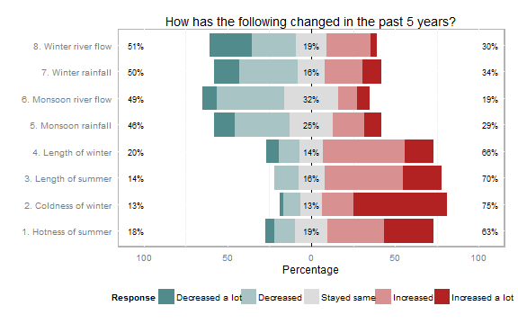

Visualizing Likert scale responses using __likert__ R package
========================================================

Diverging stacked bar chart is arguably the best way to plot Likert scale responses. I am using the **Likert** package to visualize responses of a survey on perception of climate change that I am carrying out for my PhD. This is the code I am using to generate the charts. I will update the code as I progress with my research.

The sample data used here is a dummy data and not the data from my research.

Required packages
-----------------
The required packages can be installed using the following commands.
```{r eval=FALSE}
install.packages("likert")
install.packages("xlsx")
```

Code
-----------

First step is to load the packages.
```{r}
require(xlsx) #only if excel file is to be read
require(likert)
```


Next step is to read the data and to process the data as factor.
```{r}
dataFile <- "C:/Users/Lenovo/Dropbox/Napier/PhD/Data Entry/randomData.xlsx"
myData <- read.xlsx(dataFile, sheetName = "Sheet1") #read excel sheet
myData <- myData[,-1] #dropping first column
myData <- data.frame(myData) #convert to data frame
names(myData) <- c("1. Hotness of summer", "2. Coldness of winter",
                   "3. Length of summer", "4. Length of winter",
                   "5. Monsoon rainfall", "7. Winter rainfall",
                   "6. Monsoon river flow", "8. Winter river flow")
#factor levels defined in the data
textChoices <- c("Decreased a lot", "Decreased",
                 "Stayed same",  "Increased", "Increased a lot")
#columns to factor
for (i in 1:length(myData)) {
  myData[,i] <- factor(myData[,i], levels=textChoices)
}
```

Now to use the **likert** function.
```{r}
myLikert <- likert(myData)
```
And finally, generating the plots.
```{r fig.width=8, fig.height=5}
plot(myLikert, low.color="darkslategray4", neutral.color="gainsboro",
     high.color="firebrick", ordered=FALSE,
     panel.arrange = "h") +
  ggtitle("How has the following changed in the past 5 years?")
```


Grouping of responses
---------------

To be added...